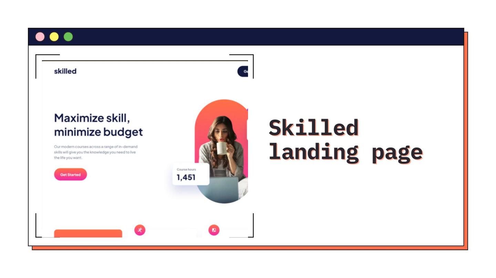
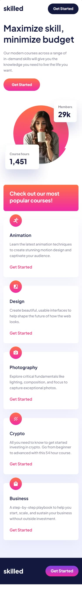
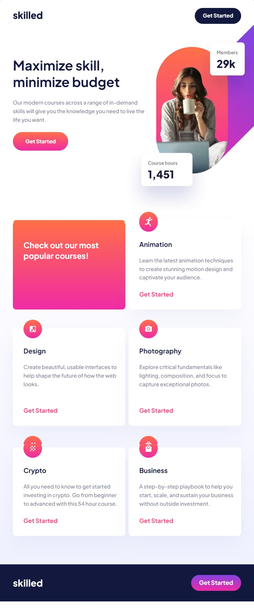
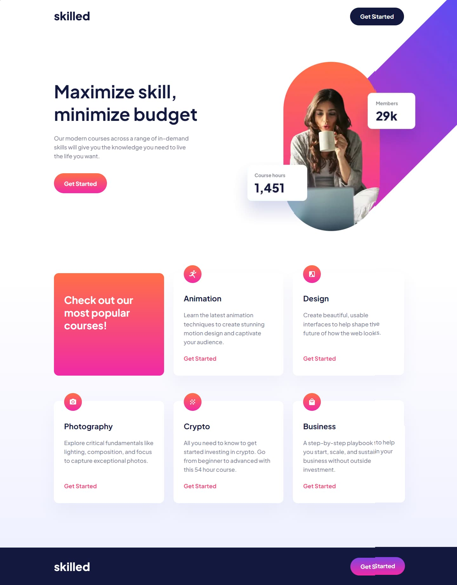

<h1 align="center">Skilled e-learning landing page
</h1>

<h2 align="center"> 
	🚧 Skilled e-learning landing page 🟢 Completed 🚀 🚧
  
</h2>

&nbsp;

<!--
## Table of contents

- [Project description](#description) - [What I learned](#What-I-learned) -->

<h2 id="#description">Project description 📚</h2>

This is a solution to the challenge
[Skilled e-learning landing page](https://www.frontendmentor.io/challenges/skilled-elearning-landing-page-S1ObDrZ8q).

This project is a challenge from the Frontend Mentor website, a single responsive page where I could practice HTML and CSS.

&nbsp;

## What I learned

This project was good to reinforce my knowledge with HTML and CSS

## Links

- [Preview Site](https://viniciusshenri96.github.io/skilled/)
- [Frontend Mentor Solution Page](https://www.frontendmentor.io/solutions/challenge-completed-with-htmlcssbemcss-grid-and-responsive-vHFKefg-EN)

&nbsp;

## My process

### Built with

- [HTML](https://developer.mozilla.org/en-US/docs/Web/HTML)
- [CSS](https://developer.mozilla.org/en-US/docs/Web/CSS)
- [Flexbox](https://css-tricks.com/snippets/css/a-guide-to-flexbox/)
- [CSS Grid](https://css-tricks.com/snippets/css/complete-guide-grid/)

&nbsp;

## Responsive 📱 - Mobile/Tablet/Desktop

<!-- ### Mobile - 375px -->

<!-- ### Tablet - 768px -->

  

   

  

<!-- ### Desktop - 1440px -->

&nbsp;

## 👨‍💻 Author

- [Frontend Mentor](https://www.frontendmentor.io/profile/viniciusshenri96)
- [Linkedin](https://www.linkedin.com/in/vinícius-henrique-7a2533229/)
